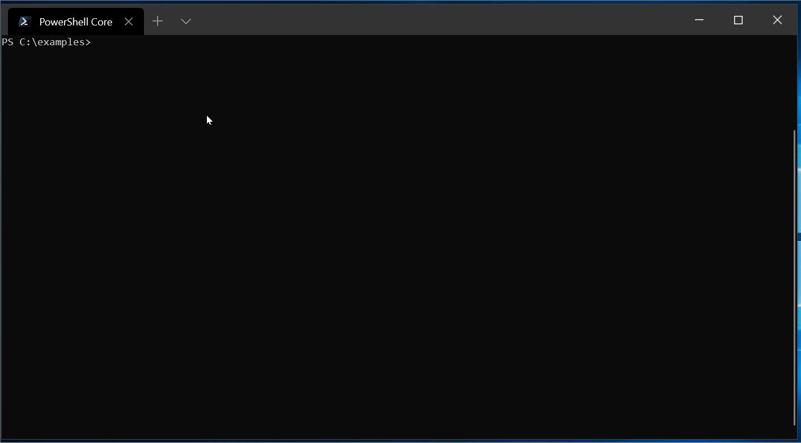

ejdict-rs
====

[](https://github.com/tomo3110/ejdict-rs)
[](https://github.com/tomo3110/ejdict-rs/blob/master/LICENSE)

This library is an English-Japanese dictionary that can be used via implemented API by Rust language.

DEMO


## Overview

This library is available through a simple API.
Since the dictionary data to be referenced is embedded in this crate,
The Japanese-English dictionary can be used immediately by simply obtaining  the crate from crates.io without depending on the database or file.

The dictionary data of this library is "ejdict" which is a public domain dictionary.
See the following URL for details.

https://github.com/kujirahand/EJDict

## Examples

This library is used through two functions.

**case1**: Look up words from dictionary.

```rust
use ejdict_rs::SearchMode;

fn main() -> ejdict_rs::Result<()> {
    let word = ejdict_rs::look("apple", SeachMode::Exact)?;
    assert_eq!(word.mean(), "『リンゴ』;リンゴの木")
}
```

**case2**: Candidate list from dictionary.

```rust
use ejdict_rs::SearchMode;

fn main() -> ejdict_rs::Result<()> {
    let candidates = ejdict_rs::candidates("apple", SeachMode::Fuzzy)?;
    for word in candidates {
        // something ...
    }
}
```

## Install

Write the following contents in Cargo.toml.

```toml
[dependencies]
ejdict_rs = { git = "https://github.com/tomo3110/ejdict-rs" }
```

## Dependencies

- crates
  - failure
    - Apache 2.0, MIT
    - Error management
  - lazy_static
    - Apache 2.0, MIT
    - Copyright (c) 2010 The Rust Project Developers
    - A small macro for defining lazy evaluated static variables in Rust.
  - serde_json
    - Apache 2.0, MIT
    - Strongly typed JSON library.
  - reqwest
    - Apache 2.0, MIT
    - Copyright (c) 2016 Sean McArthur
    - Rust HTTP Client
- dictionary data
  - ejdict-hand
    - MIT
    - Copyright (c) 2016 kujirahand
    - English-Japanese Dictionary data (Public Domain)

Thanks for the great crates and dictionary data.

## License

This software is under [MIT License](https://github.com/tomo3110/ejdict-rs/blob/master/LICENCE).

## Author

[tomo3110](https://github.com/tomo3110)

