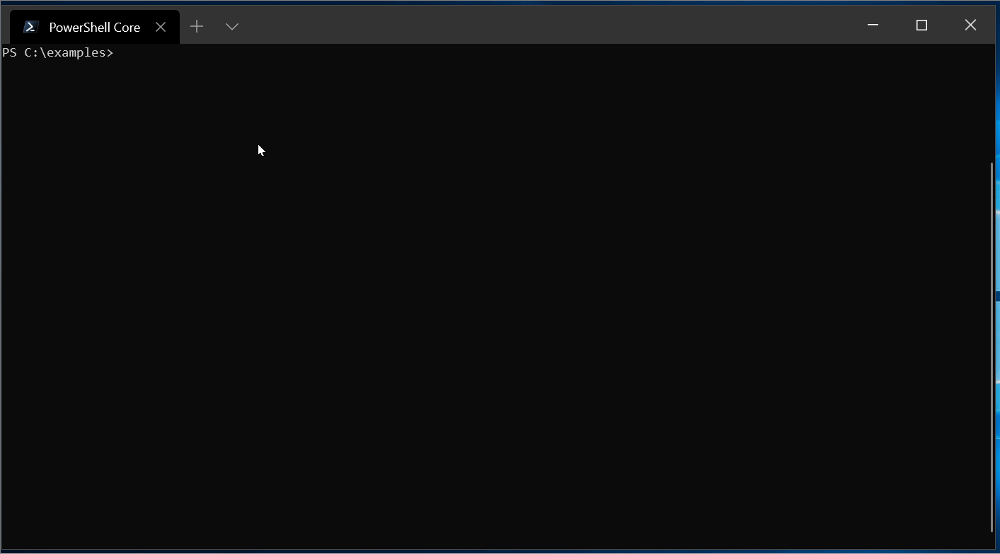

ejdict-rs-cli
===

[](https://github.com/tomo3110/ejdict-rs)
[](https://github.com/tomo3110/ejdict-rs/blob/master/LICENSE)

ejdict-cli is English-Japanese Dictionary command.

Demo


## Overview

When you want to check words, it is useful to be able to finish without leaving the development environment.

The script depends on the environment and installation is troublesome.

I wanted to finish with one binary copy and paste.

## Usages

```shell script
# 1 word look up from an English-Japanese dictionary
$ ejdict-cli look <en_word>

# selected search mode in "exact", "fuzzy" or "lower".
$ ejdict-cli look <en_word> --mode=fuzzy

# candidate list (default result number 5 words)
$ ejdict-cli candidates <en_word>

# directive result number
$ ejdict-cli candidates <en_word> -n 3

# output format json
$ ejdict-cli candidates <en_word> --json
```

Please execute "ejdict-cli help" for details.

## Install

coming soon ...

## Dependencies

- clap
  - Apache 2.0, MIT
  - Copyright (c) 2015-2016 Kevin B. Knapp
  - Command Line Argument Parser.
- prettytable-rs
  - 3-clause BSD license
  - Copyright (c) 2019, Pierre-Henri Symoneaux
  - print aligned and formatted tables
- serde_json
  - Apache 2.0, MIT
  - Strongly typed JSON library.

Thanks for the great crates.

## License

This software is under [MIT License](https://github.com/tomo3110/ejdict-rs/blob/master/LICENCE).
